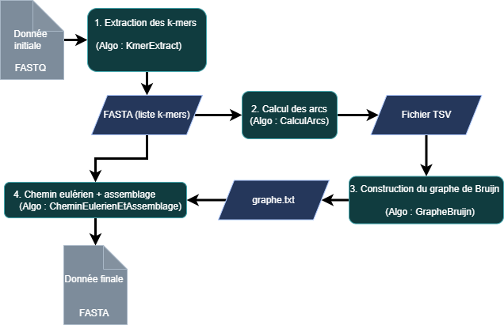

# Genome_assembly

brought to you by an amazing team : Najat, Tara and Anaelle! 

Objectif de TP : Création d'un outil d'assemblage de génome sur un jeu de données de tailles réduites 

=> Méthode Eulérienne avec Graphe de Bruijn 

DeBruijnAssembler
=================

Petit assembleur basé sur un graphe de De Bruijn et la recherche de chemins eulériens
implémenté en C++.

Usage
-----

Compilation (dans le répertoire `genome_assembly`):

    make

Exécution:

    ./assembler reads.fastq.fq k out.fa

où `k` est la taille du k-mer (entier >= 2). Le programme lit un fichier FASTQ simple
et produit un fichier FASTA avec les contigs reconstruits.

